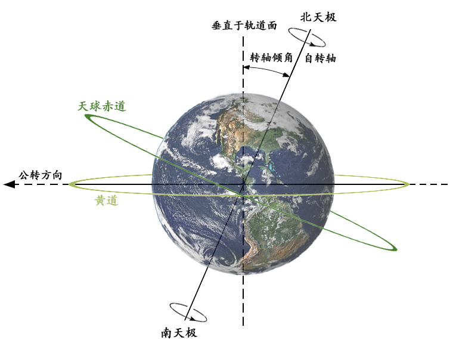
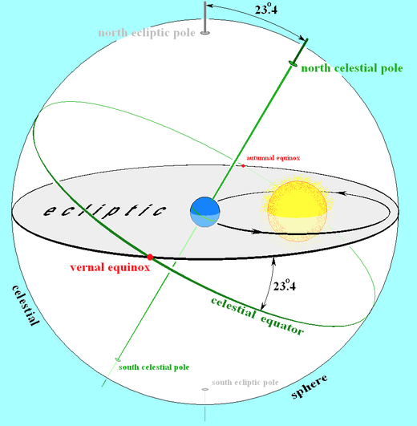
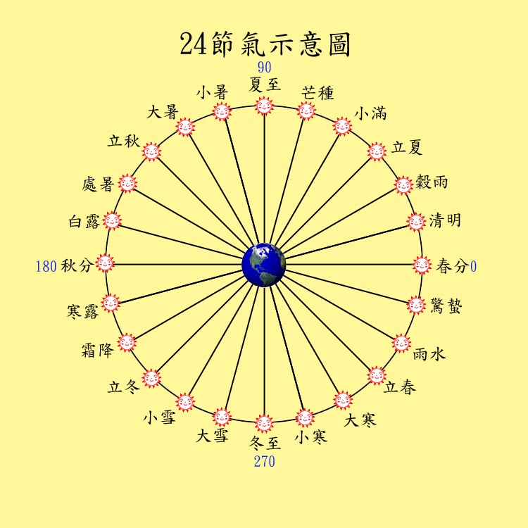
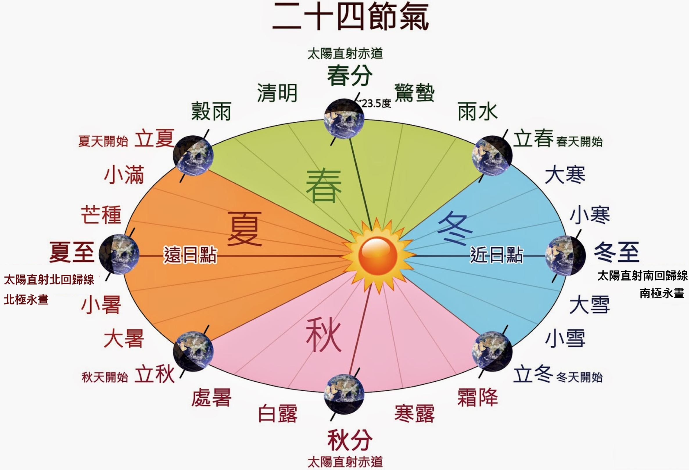
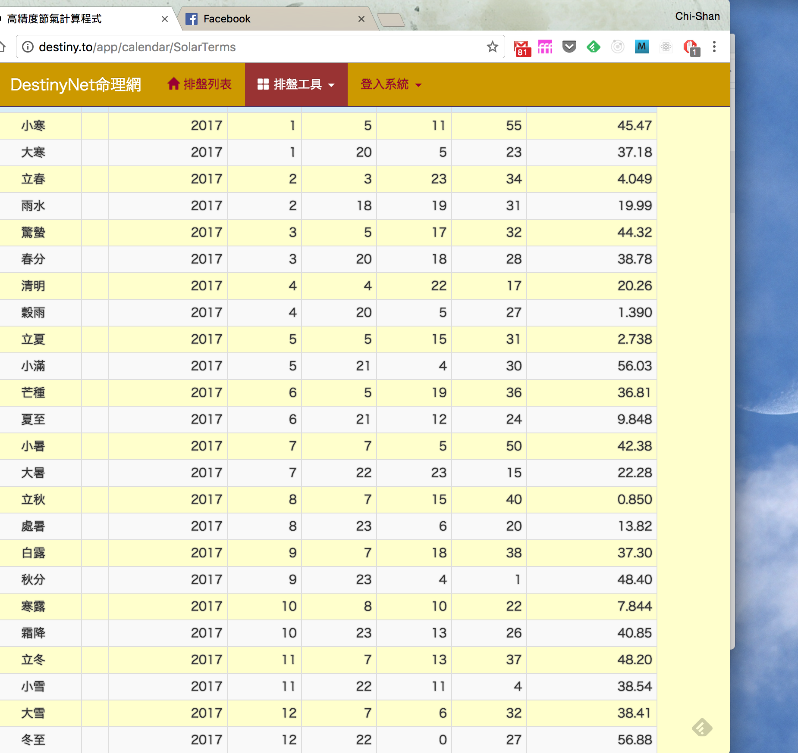
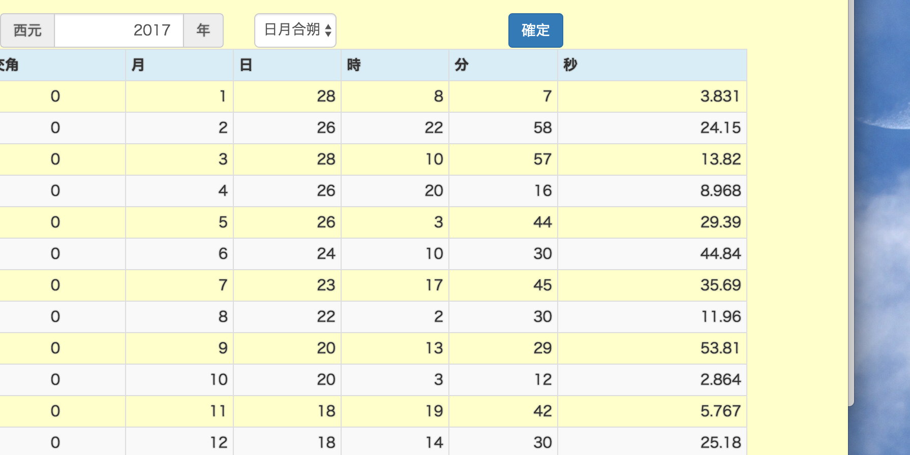
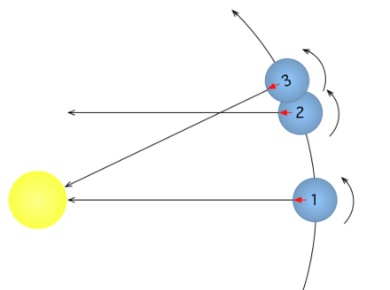
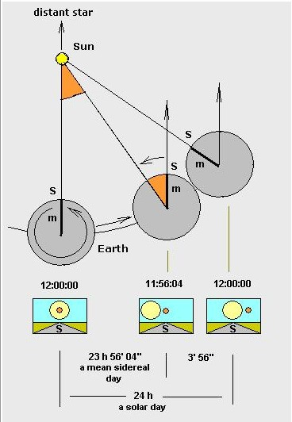
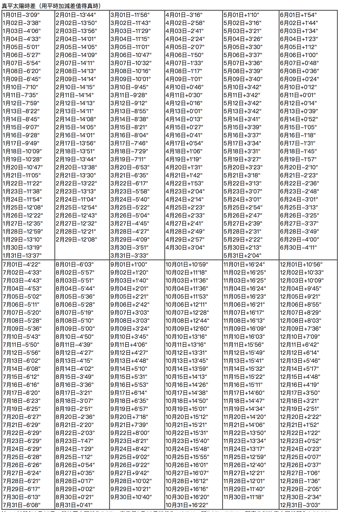

# 閏月/合朔/節氣/太陽日

## 24節氣

- 地球繞行太陽一週稱為一年，24節氣是依據地球繞行太陽軌道(黃道)切割成24等份而來的，其功與西曆的12月份劃分類似但更為仔細，用來幫助古代中國人在一年當中維持適當的生活作息。
- 以前的中國時依據均等日期來分隔24節氣，節氣之間都間隔相同的日數，此種安節氣的方法稱為**平氣法**。到了清朝之後改以均等角度來切割24節氣，節氣之間在黃道面都相差15度角，此種安節氣的方法稱為**定氣法**，
- 地球的赤道面因為與黃道面不是水平，所以天文學另外定義一個天球赤道。天球赤道是在天球上的一個大圓，它與地球的赤道是同一個平面。換言之，天球赤道是地球赤道在天球上的投影。相同的結果是地球的軌道傾角，使天球的赤道相對於黃道平面傾斜約23.5°
- 由於黃道與天球赤道不是在同一個平面，所以一年當中只會有兩個時間，兩個軌道會交叉，在交叉的時候，太陽會正射在赤道
- 這兩個交叉的時間分別就定義為節氣的春分(0度)與秋分（180度)。清朝的湯若望強制定義春分就是零度的交叉點，以此類推定義出其他的節氣

- 其實從周朝開始的曆法，**冬至被定位為一年的開始**，後來才將一月一日作為一年的開始。自冬至點到次一年的冬至點整個回歸年360度平分為十二等份，每個分點稱為『中氣』，再將兩個中氣間的角度等分，其分點稱為『節氣』，十二個中氣加十二個節氣，統稱為二十四節氣。節氣名稱以黃河流域地區的寒暑變化及耕耘播種之農時命名。
- 由上面的論述可知，所謂的24節氣，其實就是把太陽軌道區分為24個等分點的名詞定義
- 早期的節氣設定採用「平氣法」，也就是每一節氣之間差距的日數幾乎相等。自清朝康熙之後，才改為將每一個節氣之間以黃道面的角度等分，也就是每一節氣之間的角度差一定是15度

### 節氣之間的日期長短
- 因為地球繞行太陽是橢圓形軌道，地球位於橢圓其中的一個焦點。所以地球與太陽的距離並非固定
- 當地球距離太陽比較遠的時候(接近北半球的夏天)，運行速度慢，所以運動15度的時間較長，也造成節氣之間的日期比較長
- 當地球距離太陽比較近的時候(接近北半球的冬天)，運行速度快，所以運動15度的時間較短，也造成每一個節氣之間的日期比較短
- 至於為何距離太陽元的時候，北半球反而是冬天，這個與地球以相對於黃道面23.5度的傾斜角自轉有關。當遠日點的時候，北半球的北回歸線因為地球傾斜的關係被太陽直射，所以才會是夏天。當近日點的時候，南半球的南回歸線反而因為地球傾斜的關係被太陽直射，所以北半球會是冬天。

## 朔望/太陰曆/日月合朔
- 日月合朔的定義，來自於太陰曆
- 所謂太陰曆，就是以月亮從朔(全暗)到望(最亮)再到朔之間的日期作為一個月
- 所謂的朔日(或合朔日)，就是月亮與太陽地球剛好一直線，但是月亮位在地球與太陽兩者之間的日期
- 朔日的開始，才是每一個農曆月份的開始點
- 每一個朔日之間的差距大約是29.53059日
- 基於以上理由，因此古代的陰曆月採用一個大月30 日、小月 29 日輪流出現，如此平均 29.5 日
- 按大月小月輪流排法稱為「平朔」
- 但是如此規律的排法，會讓每 33 個月會就差到一天 0.0306 * 33 = 1.0098 日
- 平朔最大的缺點就是，有時初一還會看到月亮
- 從唐朝開始，農曆已能掌握月亮的不規則運動，因此放棄原來陰曆月一大一小輪流排法，而根據月亮實際運行情況置一個月 29 日或 30 日，最多曾發生四連大月
- 按月亮實際盈虧來決定月的大小，稱為「定朔」
- 完全利用月亮繞行地球一週作為一個月的曆法成為太陰曆，因為十二個太陰曆月份的時間與實際一年的時間差異太大，所以純粹的太陰曆目前幾乎沒有在用

## 農曆
- 農曆又稱為陰曆，是結合太陽曆與太陰曆
- 月朔日即是初一
- 月以中氣得名
- 以包含雨水中氣月為正月，即是「寅」月
- 月無中氣者為閏月，以前月同名

## 閏月

- 閏月的配置，與24節氣和太陰朔日的差額有關。
- 由以上的說明可知，朔月與12節(或12氣)之間的日期不會相等，
- 也就是月球繞地球一週的時間為單位，這種單位稱為「月」，十二個月為一年。這裡所稱的「月」是指「朔望月」，等於29.53059日，接近29.5日，大月30天、小月29天，全年各有6個大小月，並以「朔」為當月初一，合計354日，但12個朔望月的實際長度為354.3671平均太陽日，為使更接近平均曆年的長度，計算0.3671約等於11/30，故每30年（陰曆）中置11個閏年（閏年每年有355天），平均大約每三年就閏年一次。
- 在實務上，就是當一個朔月之內沒有中氣，就定義該月是閏月，月份編號採用上一個月份的編號(例如原本應該是七月的月份沒有中氣，七月就標為閏六月，下一個原本的八月就改為七月)。
- 也就是說，因為本來屬於這個月的中氣變到下個月使用。所以下個月的才採用這個月該用的編號

#### 閏月的月份

- 由於節氣是依據等分角度而來的，夏天時地球遠離太陽運行速度慢，所以節氣之間的日期長，相對於朔日之間的日期都是29.5天來說，在夏天比較容易發生沒有中氣的月份。反之，冬天時地球離太陽近所以運行速度快，節氣之間的日期短，所以冬天幾乎不會發生沒有中氣的月份
- 所以，常見的閏月都在五、六，七，八這幾個月。偶而發生在四月，就會有閏四月兩個清明節的狀況

### 2017年為何是閏六月？
[節氣朔日查詢網站](http://destiny.to/app/calendar/LunarPhase)

- 這是2017年每一個節氣開始的日期與時間

- 這是2017年每一個朔月開始的日期與時間

- 因為7/23到8/22之間只有立秋，沒有中氣，所以這一個月屬閏月，也就是閏6月

### 日月合朔的日期問題
- 古代中國以日月合朔發生的日期，做為當月的初一
- 但是，以上看似簡單的初一規則，卻會因為一日開始的時間而發生問題
- 首先，古代中國是以晚上11:00做為一天的開始時間，又稱為「子初初刻」。但是，現代受到西方文化的影響，早己將一天的開始時間訂在晚上12:00，又稱為「子正初刻」。不同的日期切割時間與合朔時間的先後，會導致月份開始的日期不同。
- 若以國曆55年1月21日為例，日月合朔在此日的23:46，因此以現代曆家的算法因日月合朔尚未過零時(即24:00)，即以陽曆的1月21日（干支庚辰）為55年的陰曆初一，但是若從古代曆家的算法，則因日月合朔之時刻已過子時初初刻 (即23:00) 所以應該以五十五年陽曆的1月22日（干支辛巳）為初一日，
- 很不幸的，目前市售的萬年曆，都是以子正初刻來設計換日，所以萬年曆的日期會比實際的日期相差一天。此一日期誤差，會一直持續到下一次發生日月合朔之時，才會修正回來

### 真太陽日／平太陽日
- 地球自轉的周期是一個恆星日，目前其值為23時56分2.1秒。
- 地球相對於太陽的轉動一週的時間（從正午至正午）稱為真太陽日或視太陽日
- 因為地球繞日運行的軌道是橢圓的，所以地球相對於太陽的自轉週期並不十分均勻，一年之內，有的時期快些，有的時期慢些，平均起來，折合一天24小時，稱為平太陽時
- 不論真或平太陽日的時間都比恆星日長，原因如下：
 

   - 由地球的北極往南看，地球的公轉與自轉都是相同的逆時針方向
    - 在像地球的一個順行平面，恆星日是短於太陽日。在時間點1，太陽和遙遠的恆星都在頭頂上（在相同的方向上）；在時間點2，行星轉動360°，遙遠的恆星右出現在頭頂上，但太陽並不在頭頂上（1→2 = 一恆星日）；太陽要稍後，在時間點3，才會抵達頭頂上（1→3 = 一太陽日）。因此，平均太陽日實際的時間比恆星日長大約三分五十七秒
    - 一年共有365.2422個太陽日, 或366.2422個恆星日。
    

- 以相同的理由，因為地球繞行太陽是橢圓形，在近日點(冬天)的時候，地球要從時間點2轉到時間點3的時間比平均太陽日長，其實冬至的真太陽日幾乎是一年當中最長的一天。相反來說，在遠日點(夏天)的時候，可以想像太陽與地球的距離類似恆星與地球那麼遠，所以地球在時間點2的時候，太陽就幾乎在頭頂，所以真太陽日比平太陽日短，其實夏至的真太陽日幾乎是一年當中最短的一天。

### 真太陽日修正對月份日期的影響
- 真太陽日的日期長短對於月份日期的影響，與日月合朔的時間有關
- 舉例來說，如果某年國曆10月10日台北晚上10：52發生農曆9月份的日月合朔，按曆法，10月10日應算農曆的9月1日，但是因為一般的天文資料都是以時區中線為基準點發佈。考慮台北經度121.5度修正到120度的地理時間差，農曆9月份的日月合朔時間要先增加約6分鐘變為晚上10:58，雖然很接近換日的晚上11:00，但還是在10月10日。如果再考慮真太陽日造成時間加長，9月份的日月合朔時間還要再加13分16秒。所以實際9月份日月合朔的天文時間是晚上11：09分16秒，己經是10月11日的子時，所以農曆9月1日應該在10月11日。此一修改同樣會一直持續到下一次日月合朔為止(也就是下個農曆月)

## 參考資料
- [參考1](https://tambingblog.wordpress.com/2012/10/01/%E6%96%97%E6%95%B8%E9%96%8F%E6%9C%88%E8%B5%B7%E7%9B%A4%E6%8E%A2%E7%A9%B6/)
- [參考2](http://blog.sina.com.tw/abraham/article.php?entryid=573154)
- [參考3](https://www.duosuccess.com/tcm/004a05061109o.htm)
- [參考4](https://zh.wikipedia.org/wiki/%E5%9C%B0%E7%90%83%E8%87%AA%E8%BD%AC#.E6.81.92.E6.98.9F.E6.97.A5.E8.88.87.E5.A4.AA.E9.99.BD.E6.97.A5)
- 以**平氣法**切割的節氣，閏月出現在任何月份的機率幾乎都一樣。相對來說，以**定氣法**切割的節氣，閏月幾乎都出現在夏季。

