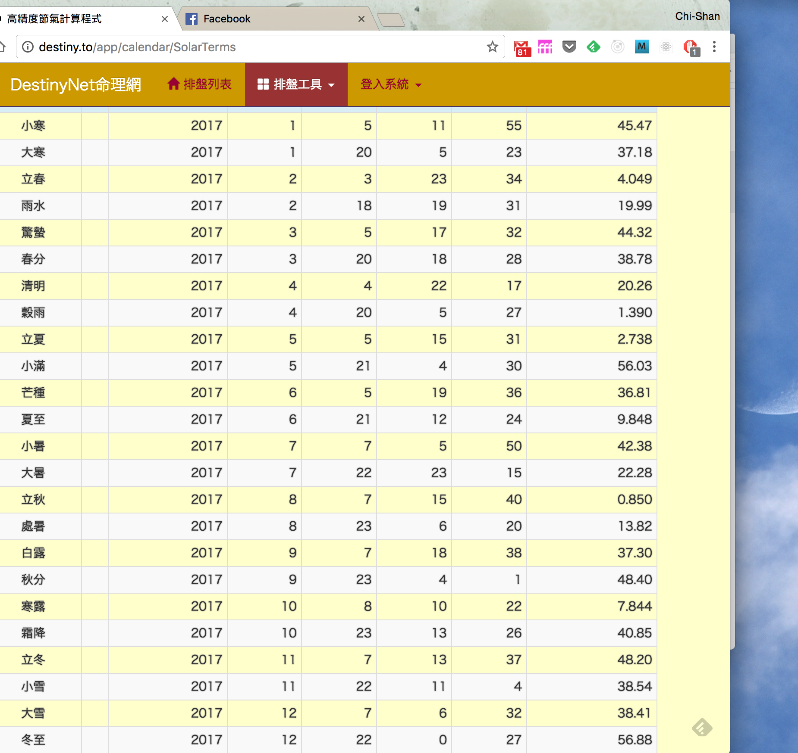
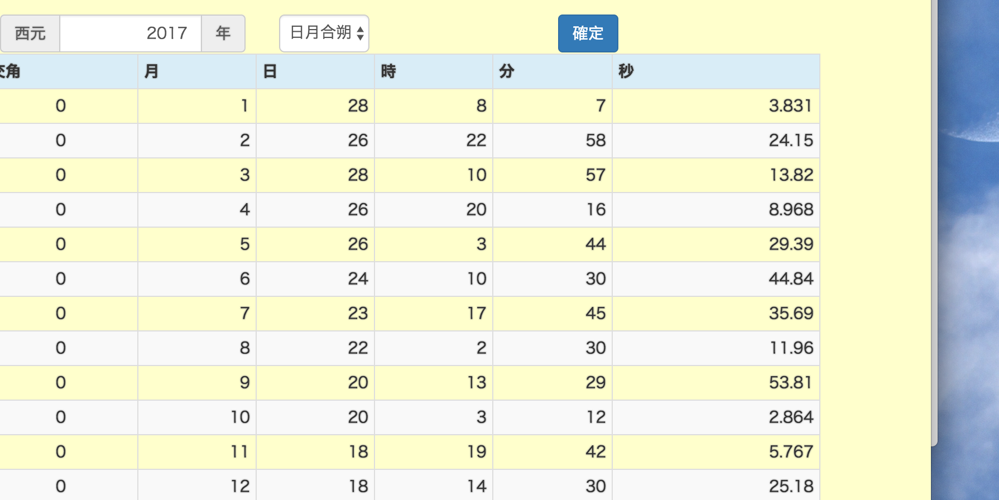

# 閏月/合朔/節氣

## 24節氣

- 24節氣是依據太陽軌道(黃道)運360度等份而來的
- 地球的赤道面因為與黃道面不是水平，所以天文學另外定義一個天球赤道。天球赤道是在天球上的一個大圓，它與地球的赤道是同一個平面。換言之，天球赤道是地球赤道在天球上的投影。相同的結果是地球的軌道傾角，使天球的赤道相對於黃道平面傾斜約23.5°
- 由於黃道與天球赤道不是在同一個平面，所以一年當中只會有兩個時間，兩個軌道會交叉，在交叉的時候，太陽會正射在赤道
- 這兩個較差的時間分別就定義為節氣的春分(0度)與秋分（180度)。在清朝之後，強制定義春分就是零度的交叉點，以此類推定義出其他的節氣

- 中國古代的曆法，就已經考慮了這個問題。古代曆法家取**冬至為一年的開始**，自冬至點到次一年的冬至點整個回歸年的時間平分為十二等份，每個分點稱為『中氣』，再將兩個中氣間的長度等分，其分點稱為『節氣』，十二個中氣加十二個節氣，統稱為二十四節氣。節氣名稱以黃河流域地區的寒暑變化及耕耘播種之農時命名。
- 由上面的論述可知，所謂的24節氣，其實就是把太陽軌道區分為24個等分點的名詞定義
- 每一個節氣之間一定是15度

### 節氣之間的日期
- 不過，因為地球繞行太陽是橢圓形軌道，地球位於橢圓其中的一個焦點。所以地球與太陽的距離並非固定
- 當地球距離太陽比較遠的時候(接近夏天)，運行速度慢，所以每一個節氣之間的日期比較多
- 當地球距離太陽比較近的時候(接近冬天)，運行速度快，所以每一個節氣之間的日期比較短

## 朔望/太陰曆
- 合朔的定義，來自於太陰曆
- 所謂太陰曆，就是以月亮蔥朔(全暗)到望(最亮)再到朔之間的日期作為一個月
- 所謂的朔日，就是月亮與太陽地球剛好一直線，但是月亮位在地球與太陽兩者之間得日期
- 所以，朔日的開始，才是每一個農曆月份的開始點
- 每一個朔日之間的差距大約是29.3059日

## 農曆
- 陰曆基本法則如下
- 月朔日即是初一
- 月以中氣得名
- 以包含雨水中氣月為正月，即是「寅」月
- 月無中氣者為閏月，以前月同名

## 閏月

- 閏月的配置，與24節氣和太陰朔望的差額有關。
- 由以上的說明可知，朔月與12節(或12氣)之間的日期不會相等，
- 也就是月球繞地球一週的時間為單位，這種單位稱為「月」，十二個月為一年。這裡所稱的「月」是指「朔望月」，等於29.53059日，接近29.5日，大月30天、小月29天，全年各有6個大小月，並以「朔」為當月初一，合計354日，但12個朔望月的實際長度為354.3671平均太陽日，為使更接近平均曆年的長度，計算0.3671約等於11/30，故每30年（陰曆）中置11個閏年（閏年每年有355天），平均大約每三年就閏年一次。
- 在實務上，就是一但一個朔月之內沒有中氣，就定義該月是閏月，月份編號採用上一個月份的編號。
- 也就是說，因為本來屬於這個月的中氣變到下個月使用。所以下個月的才採用這個月該用的編號

### 2017年的閏六月
[節氣朔日查詢網站](http://destiny.to/app/calendar/LunarPhase)

- 這是2017年每一個節氣開始的日期與時間

- 這是2017年每一個朔月開始的日期與時間


- 因為7/23到8/22之間只有立秋，沒有中氣，所以這一個月屬閏月，也就是閏6月

## 參考資料
- [參考1](https://tambingblog.wordpress.com/2012/10/01/%E6%96%97%E6%95%B8%E9%96%8F%E6%9C%88%E8%B5%B7%E7%9B%A4%E6%8E%A2%E7%A9%B6/)

